---
# try also 'default' to start simple
theme: seriph
# random image from a curated Unsplash collection by Anthony
# like them? see https://unsplash.com/collections/94734566/slidev
background: https://upload.wikimedia.org/wikipedia/commons/c/cc/Digital_rain_animation_medium_letters_shine.gif
# some information about your slides (markdown enabled)
title: FCReverseProxy-presentation
info: |
  ## Slidev Starter Template
  Presentation slides for developers.

  Learn more at [Sli.dev](https://sli.dev)
# apply UnoCSS classes to the current slide
class: text-center
# https://sli.dev/features/drawing
drawings:
  persist: false
# slide transition: https://sli.dev/guide/animations.html#slide-transitions
transition: slide-left
# enable MDC Syntax: https://sli.dev/features/mdc
mdc: true
---

# FCReverseProxy

### Made by Felipe Campolina Soares de Paula


<div class="abs-br m-6 text-xl">
  <a href="https://github.com/felipecampolina/FCReverseProxy/tree/main" target="_blank" class="slidev-icon-btn">
    <carbon:logo-github />
  </a>
</div>

<!--
The last comment block of each slide will be treated as slide notes. It will be visible and editable in Presenter Mode along with the slide. [Read more in the docs](https://sli.dev/guide/syntax.html#notes)
-->

---
layout: two-cols
layoutClass: gap-16
---

# Table of contents

<Toc text-sm minDepth="1" maxDepth="5" />


---
theme: default
layout: center
class: text-center
---

# About Myself

👨‍💻 **Felipe Campolina**  
*Software Engineer / Full Stack Developer*  

---

##  Experience
- 🚀 **Full Stack Developer @ Biobyte Brasil** *(Feb 2024 – Present)*  
  *Angular · Node.js · Express.js · TypeScript · SQL · MongoDB · AWS (EC2, S3, Lambda, IAM) · GPT/LLMs · RAG Pipelines · Pentaho DTI*  

- 🎓 **Web Developer Scholarship Holder @ PUCTEC** *(Jul 2023 – Dec 2023)*  
  *HTML · CSS · JavaScript · Bootstrap · PHP · Laravel · WordPress · MySQL · Git*  

- 💻 **Front-End Developer Trainee @ Abil Agency** *(May 2022 – Jun 2023)*  
  *HTML · CSS · JavaScript · Bootstrap · UI/UX · Responsive Design · SEO*  

- 🧑‍🏫 **Technical Tutor @ PUC Minas** *(Jun 2022 – Jul 2023)*  
  *C · C++ · Java · Programming Fundamentals · Algorithms*  

---

##  Education

###  B.Sc. Computer Science  
**Pontifical Catholic University of Minas Gerais (PUC Minas)**  
*(2022 – 2026)*  


###  B.Sc. Computer Engineering  
**Polytechnic Institute of Guarda (IPG – Portugal)**  
*(2025 – 2026)*  

<style>
h2 {
  color: #2B90B6;
  margin-bottom: 1.2rem;
}
h3 {
  margin-top: 1.2rem;
  color: #146b8c;
}
</style>


---
theme: default
layout: center
class: text-center
---

# Forward Proxy vs Reverse Proxy

Many businesses use proxy servers to route and secure traffic.  
But how is a **forward proxy** different from a **reverse proxy**?  

---

## Forward Proxy
- Routes traffic **from multiples clients → external system**  
- Masks client IP addresses & enforces policies  
- Regulates access, blocks unknown traffic  
- Common in businesses & data centers  

 Example: Company proxy that filters employee traffic to the Internet  


## Reverse Proxy
- Routes traffic **from client → backend servers**  
- Protects server identity from clients  
- Clients see only the reverse proxy, not the actual servers  
- Can perform **load balancing**, **SSL termination**, **firewall filtering**  

 Example: Users connect to `proxy.myapp.com` which forwards requests to multiple backend servers  

---

## Why Use a Reverse Proxy?
- Centralized **security & access control**  
- Simplifies server management (servers only accept proxy traffic)  
- Easy to **add/remove servers** without client changes  
- Improves performance via **load balancing & caching**  
<style>
h1 {
  background-color: #2B90B6;
  background-image: linear-gradient(45deg, #4EC5D4 10%, #146b8c 20%);
  -webkit-background-clip: text;
  -webkit-text-fill-color: transparent;
}
h2 {
  color: #2B90B6;
  margin-bottom: 1rem;
}
table {
  font-size: 0.9rem;
  margin-top: 1rem;
}
</style>

---
theme: default
layout: center
class: text-center
---

# FCReverseProxy

**My solution for the Traefik Challenge**


---

## Overview

**FCReverseProxy** is a lightweight, high-performance reverse proxy written in Go.

It is designed with scalability, resilience, and observability in mind, featuring:


<style>
table {
  font-size: 0.70rem;
  line-height: 1.1;
}
</style>

| Category | Description |
|----------|-------------|
| **Caching** | - In-memory LRU cache <br> - Configurable cache size |
| **Load Balancer** | - Round Robin and Least Connections algorithms <br> - Even traffic distribution |
| **Health Checker** | - Periodic health checks <br> - Auto removal/recovery of backends |
| **TLS Termination** | - HTTPS support with TLS offloading <br> - Configurable certificates |
| **Request Queue** | - Request queuing during high load <br> - Configurable queue size and backpressure control |
| **Unit Tests** | - Coverage for core modules <br> - Reliability and correctness validation |
| **Metrics & Dashboard** | - Prometheus metrics <br> - Grafana dashboard for live monitoring |
| **Logging** | - Structured logs via Loki and Promtail <br> - Centralized observability |

---


## Caching

- Improves response times by storing previously fetched responses in memory.
- Reduces load on backend servers by serving frequent requests from cache.
- Useful for high-read, low-change workloads (e.g., static content, APIs with repeated queries).


---

### Caching Implementation in FCReverseProxy
- **Purpose**: Reduce backend load and improve response times.
- **Type**: In-memory LRU (Least Recently Used) cache.
- **Key Features**:
  - Configurable cache size.
  - TTL (Time-to-Live) for cached entries for non cache response.
  - Cache HIT/MISS tracking.

---

### How It Works

<div class="grid grid-cols-2 gap-6 leading-relaxed">

<div>

<div class="mb-6">
  <h3>1. Cacheable Requests</h3>
  <ul>
    <li>Checked using <code>isCacheableRequest</code></li>
    <li>Skips <code>no-store</code> or <code>no-cache</code> requests</li>
    <li>Requires <code>public</code> directive with <code>Authorization</code></li>
  </ul>
</div>

<div class="mb-6">
  <h3>2. Cache Key</h3>
  <ul>
    <li>Generated with <code>buildCacheKey</code></li>
    <li>Includes method, URL, headers, optional body hash</li>
  </ul>
</div>

</div>

<div>

<div class="mb-6">
  <h3>3. Cache HIT</h3>
  <ul>
    <li>Returns valid entry if found</li>
    <li>Adds headers: <code>X-Cache: HIT</code>, <code>Age</code>, <code>X-Request-ID</code></li>
  </ul>
</div>

<div class="mb-6">
  <h3>4. Cache MISS</h3>
  <ul>
    <li>Forwards request to upstream</li>
    <li>Validates response with <code>isCacheableResponse</code></li>
    <li>Stores entry in cache with TTL</li>
  </ul>
</div>

</div>

</div>

---

###  Code Example: `isCacheableRequest`

<div class="grid grid-cols-2 gap-6 leading-relaxed">

<div>

```go
func isCacheableRequest(req *http.Request) bool {
	cacheControl := parseCacheControl(req.Header.Get("Cache-Control"))

	// Respect explicit client directives.
	if _, ok := cacheControl["no-store"]; ok {
		return false
	}
	if _, ok := cacheControl["no-cache"]; ok {
		return false
	}

	// Heuristic: avoid caching when Authorization is present
	// unless "public" is provided.
	if req.Header.Get("Authorization") != "" {
		if _, isPublic := cacheControl["public"]; !isPublic {
			return false
		}
	}
	return true
}
```

</div>

<div>

### Observation

- HTTP requests with `Authorization` headers usually **should not be cached** to avoid leaking sensitive data.
- This logic allows an exception:
  - If the client includes `Cache-Control: public`, the response **can be cached** even if it's authenticated.
- It follows a **secure-by-default policy**, requiring **explicit opt-in** for caching authenticated content.

</div>

</div>

---

###  Code Example: `buildCacheKey`

<div class="grid grid-cols-2 gap-6 leading-relaxed">

<div>

```go
func buildCacheKey(req *http.Request) string {
	keyBuilder := strings.Builder{}
	keyBuilder.WriteString(req.Method)
	keyBuilder.WriteString(" ")
	keyBuilder.WriteString(req.URL.Scheme)
	keyBuilder.WriteString("://")
	keyBuilder.WriteString(req.Host)
	keyBuilder.WriteString(singleJoiningSlash("", req.URL.Path))
	if req.URL.RawQuery != "" {
		keyBuilder.WriteString("?")
		keyBuilder.WriteString(req.URL.RawQuery)
	}
	keyBuilder.WriteString("|a=")
	keyBuilder.WriteString(strings.TrimSpace(req.Header.Get("Accept")))
	keyBuilder.WriteString("|ae=")
	keyBuilder.WriteString(strings.TrimSpace(req.Header.Get("Accept-Encoding")))
	return keyBuilder.String()
}
```

</div>

<div>

### Observations

- This function generates a **unique cache key** per request based on:
  - HTTP method, URL scheme, host, path, and query string.
  - Headers like `Accept` and `Accept-Encoding` for content negotiation.
- Ensures that different client variants (e.g. `gzip`, `json`) do **not share** the same cached response.
- The consistent structure enables safe reuse of cached entries **across upstream targets**.


</div>

</div>


---

###  Code Example: Body Hashing

This section is part of the `serveHTTP` function, which handles requests forwarded to the upstream server. Below is the cache-specific logic extracted from the function:

<div class="grid grid-cols-2 gap-6 leading-relaxed">

<div>

```go
// Buffer body for hashing
func (proxy *ReverseProxy) ServeHTTP(w http.ResponseWriter, req *http.Request) {
var bodyHash string
if req.Body != nil {
  if bodyBytes, err := io.ReadAll(req.Body); err == nil {
    if len(bodyBytes) > 0 {
      sum := sha256.Sum256(bodyBytes)
      bodyHash = hex.EncodeToString(sum[:])
    }
    req.Body = io.NopCloser(bytes.NewReader(bodyBytes))
  }
}

// Append body hash to cache key if available
if bodyHash != "" {
  cacheKey += "|bh=" + bodyHash
}

// Stash key in context for reuse on MISS.
req = req.WithContext(context.WithValue(req.Context(), cacheKeyCtxKey{}, cacheKey))
}
```

</div>

<div>

### Observations


- If body hashing is used, the body hash is appended separately (`|bh=...`).
- To uniquely identify them, we hash the body and append it to the cache key.
- This ensures that even requests to the same URL with **different bodies** produce **distinct cache entries**.
- The body is safely **restored** after reading to avoid breaking the request flow.

</div>

</div>

---

###  Code Example: Cache HIT

This section is part of the `serveHTTP` function, which handles requests forwarded to the upstream server. Below is the cache-specific logic extracted from the function:

<div class="grid grid-cols-2 gap-6 leading-relaxed">

<div>

```go
func (proxy *ReverseProxy) ServeHTTP(w http.ResponseWriter, req *http.Request) {
if cachedEntry, found, isStale := proxy.cache.Get(cacheKey); found && !isStale {
  copyHeader(w.Header(), cachedEntry.Header)
  w.Header().Set("X-Cache", "HIT")
  ageSeconds := int(time.Since(cachedEntry.StoredAt).Seconds())
  w.Header().Set("Age", strconv.Itoa(max(0, ageSeconds)))
  w.WriteHeader(cachedEntry.StatusCode)
  _, _ = w.Write(cachedEntry.Body)
  return
}
}
```

</div>

<div>

### Observations

- **Retrieves** entry from in-memory cache if found and not stale.
- Sends:
  - `X-Cache: HIT`  
  - `Age` (based on time since cache storage)
- Skips upstream completely → **low latency, high efficiency**.

</div>

</div>
---

###  Code Example: Cache MISS

This section is part of the `serveUpstream` function, which handles requests forwarded to the upstream server. Below is the cache-specific logic extracted from the function:

<div class="grid grid-cols-2 gap-6 leading-relaxed">

<div>

```go
func (proxy *ReverseProxy) serveUpstream(w http.ResponseWriter, req *http.Request) {
  // Response from upstream, potentially cached if eligible
  isRequestEligibleForCache := proxy.cacheOn && isCacheableRequest(outboundReq) && !clientNoCache(outboundReq)
  cacheTTL, isCacheableResponse := isCacheableResponse(respWithBody(statusCode, upstreamResp.Header))
  xCacheState := "BYPASS"
  if isRequestEligibleForCache && isCacheableResponse {
    xCacheState = "MISS"
  }
  // Store in cache if eligible
  if isRequestEligibleForCache && isCacheableResponse {
    proxy.cache.Set(cacheKey, &CachedResponse{
      StatusCode: statusCode,
      Header: sanitizedHeaders,
      Body: responseBody,
      StoredAt: time.Now(),
      RequestID: getRequestID(req),
    }, cacheTTL)
  }
}
```

</div>

<div>

### Observations
- **Sets**:
  - `X-Cache: MISS` if the response is eligible for caching.
  - `X-Cache: BYPASS` if caching is not applicable.
- **Stores**: Saves the upstream response in the cache for future requests if eligible.
- Ensures the client receives the response while preparing the cache for subsequent requests.

</div>

</div>

---

###  How does a request goes to upstream?

<div class="grid grid-cols-2 gap-6">

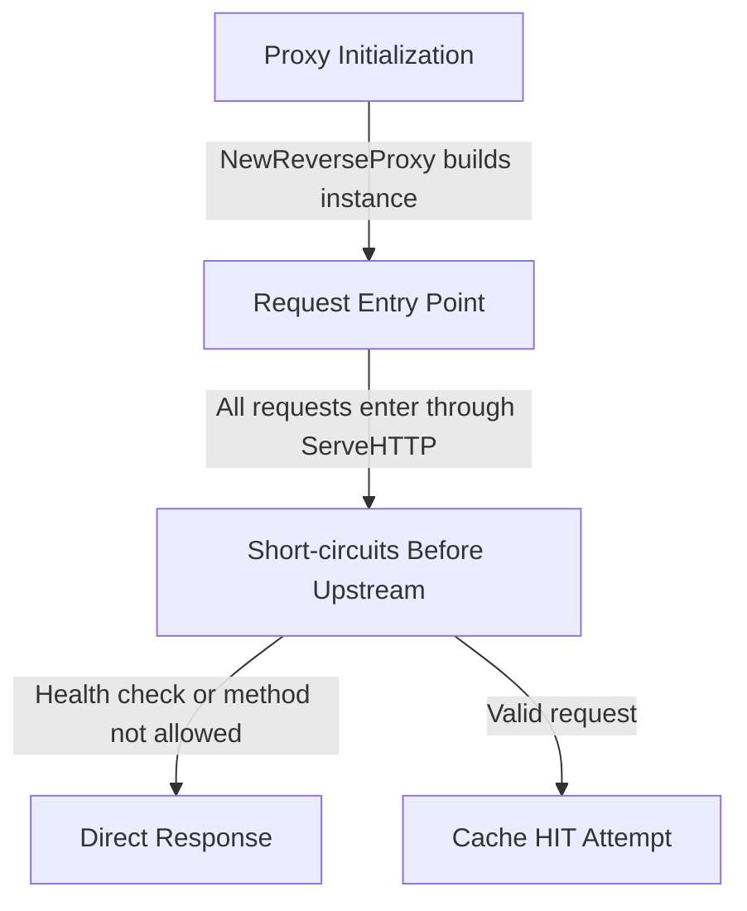

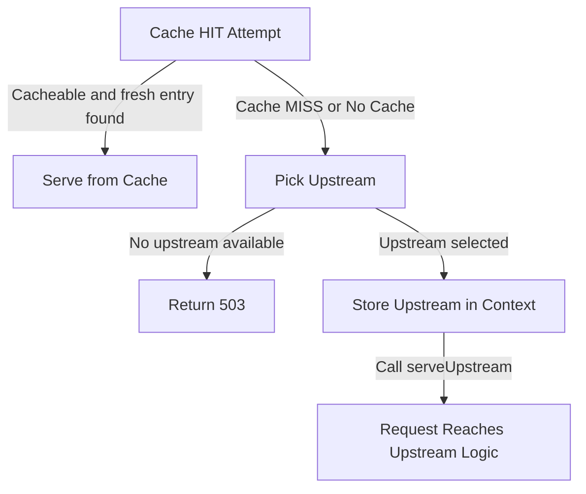

</div>

---

###  Caching — Tests

<style>
table {
  font-size: 0.70rem;
  line-height: 1.1;
}
</style>

| **Test Category**         | **Description**                                                             | **Function(s)**                                                             |
|----------------------------|-----------------------------------------------------------------------------|-----------------------------------------------------------------------------|
| **Cache HIT/MISS**         | Verifies cache population on a MISS and reuse on subsequent requests.       | `TestCache_HitAndMiss`                                                     |
| **Cache-Control Directives** | Ensures compliance with `no-cache` and `no-store` headers.                 | `TestCache_RespectsNoCacheRequestDirective`                                |
| **TTL Expiry**             | Confirms cache entries expire as per `max-age` and refresh on access.       | `TestCache_ExpiryAndRefetch`                                               |
| **Request Methods**        | Tests caching for various HTTP methods.                                     | `TestCache_POST_Hit`, `TestCache_PUT_Hit`, `TestCache_PATCH_Hit`, `TestCache_DELETE_Hit`, `TestCache_HEAD_Hit` |
| **Body Hashing**           | Validates unique cache entries for requests with different bodies.          | `TestCache_POST_DifferentBodies_NotHit`                                    |
| **Allowed Methods**        | Ensures only permitted HTTP methods interact with the cache.                | `TestDisallowedMethod_NoCacheInteraction`, `TestAllowedMethod_CacheWorksWithRestriction` |

These tests ensure correctness, performance, and adherence to HTTP caching standards.

---
clicks: 4
---

### Caching — Results from Demo Environment

- **Requests**: 8 requests sent to the same endpoint.

<!-- Fixed title block -->
<div class="relative h-8 text-xl font-semibold mt-4">
  <div v-click="[1]" class="absolute inset-0">Proxy Dashboard</div>
  <div v-click="[2]" class="absolute inset-0">Upstream Dashboard</div>
  <div v-click="[3]" class="absolute inset-0">Cache MISS Response Header</div>
  <div v-click="[4]" class="absolute inset-0">Cache HIT Response Header</div>
</div>

<!-- Fixed image block -->
<div class="relative w-full h-[400px] mt-4">
  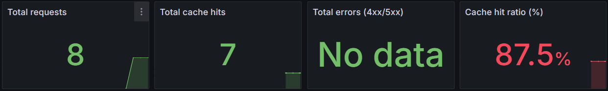
  
  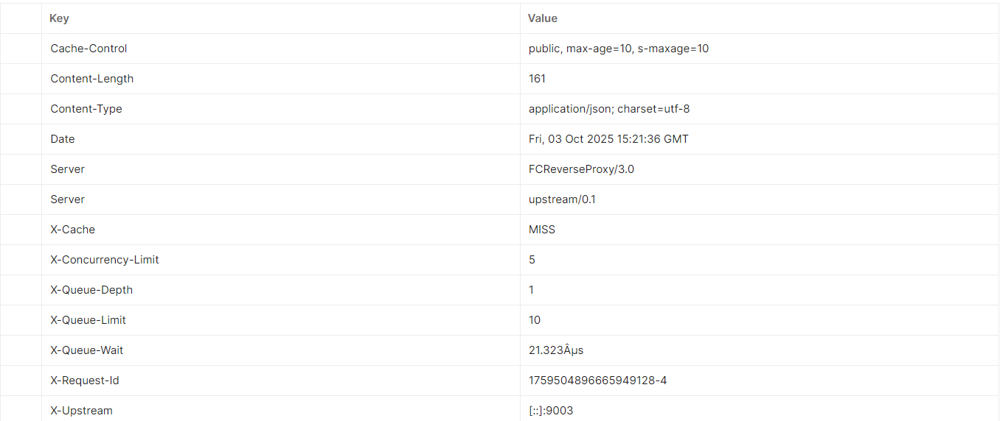
  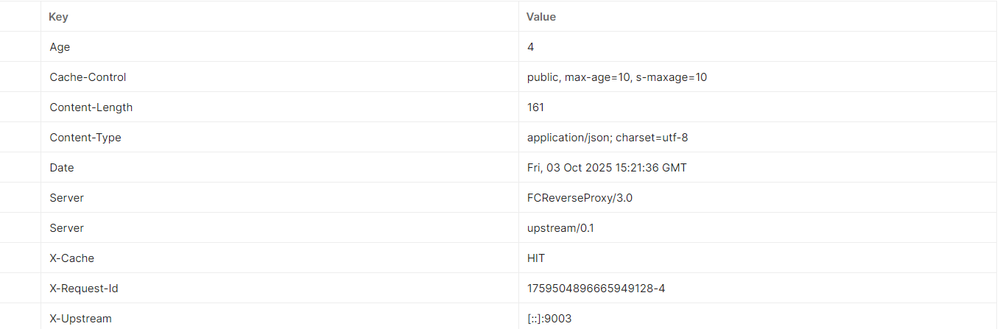
</div>

---

## Load Balancer and Health Checker

- Distributes traffic across multiple upstream servers.
- Ensures high availability and scalability.
- Supports two strategies:
  - **Round Robin**: Distributes requests evenly across all servers.
  - **Least Connections**: Routes requests to the server with the fewest active connections.
- Includes **health checks** to detect and exclude unhealthy servers.

---

### Load Balancer Implementation in FCReverseProxy

- **Purpose**: Distribute traffic efficiently and ensure fault tolerance.
- **Strategies**:
  - **Round Robin**: Cycles through servers in order.
  - **Least Connections**: Prefers servers with fewer active requests.
- **Health Checks**:
  - Enabled by default.
  - Excludes unhealthy servers from the pool.

---

### How It Works

<div class="grid grid-cols-2 gap-6 leading-relaxed">

<div>

<div class="mb-6">
  <h3>1. Strategy Selection</h3>
  <ul>
    <li>Configured via <code>ConfigureBalancer</code></li>
    <li>Supports <code>round_robin</code> and <code>least_connections</code></li>
  </ul>
</div>

<div class="mb-6">
  <h3>2. Health Checks</h3>
  <ul>
    <li>Enabled/disabled via <code>SetHealthCheckEnabled</code></li>
    <li>Excludes unhealthy servers from selection</li>
  </ul>
</div>

</div>

<div>

<div class="mb-6">
  <h3>3. Round Robin</h3>
  <ul>
    <li>Distributes requests evenly</li>
    <li>Ignores server load</li>
  </ul>
</div>

<div class="mb-6">
  <h3>4. Least Connections</h3>
  <ul>
    <li>Prefers servers with fewer active requests</li>
    <li>Balances load dynamically</li>
    <li>If multiple servers have the same load, prioritizes the first healthy server(possible improvement)</li>
  </ul>
</div>

</div>

</div>
---

### Code Example: `isTargetHealthy`

<div class="grid grid-cols-2 gap-6 leading-relaxed">

<div>

```go
func isTargetHealthy(targetURL *url.URL) bool {
	// Build absolute health URL at root (/healthz).
	scheme := targetURL.Scheme
	if scheme == "" {
		scheme = "http"
	}
	healthURL := &url.URL{
		Scheme: scheme,
		Host:   targetURL.Host,
		Path:   "/healthz",
	}
	healthRequest, err := http.NewRequest("GET", healthURL.String(), nil)
	if err != nil {
		return false
	}
	// Hint to avoid connection reuse issues on failing endpoints.
	healthRequest.Close = true
	healthResponse, err := healthProbeHTTPClient.Do(healthRequest)
	if err != nil {
		return false
	}
	defer healthResponse.Body.Close()
	// Consider 2xx/3xx as healthy.
	return healthResponse.StatusCode >= 200 && healthResponse.StatusCode < 400
}
```

</div>

<div>

### Observation

- The function performs a **shallow health check** against the `/healthz` endpoint of each upstream target.
- It uses the same scheme and issues a **GET request**.
- Declares targets as healthy **only if they return 2xx or 3xx responses**, ensuring a conservative approach to availability.

</div>

</div>


---

### Code Example Round Robin: `Pick`

<div class="grid grid-cols-2 gap-6 leading-relaxed">
<div>

```go
func (b *roundRobinBalancer) Pick(previewOnly bool) *url.URL {
	if len(b.targets) == 0 {
		return nil
	}
	if previewOnly {
		n := atomic.LoadUint64(&b.nextIndex)
		return b.targets[n%uint64(len(b.targets))]
	}
	startIndex := atomic.AddUint64(&b.nextIndex, 1) - 1
	targetCount := uint64(len(b.targets))

	if !b.healthChecksEnabled {
		return b.targets[startIndex%targetCount]
	}

	for i := uint64(0); i < targetCount; i++ {
		candidateTarget := b.targets[(startIndex+i)%targetCount]
		if isTargetHealthy(candidateTarget) {
			return candidateTarget // Important so if healthy,  does not need to check the others
		}
	}
	return nil
}
```

</div>
<div>

### Observation

- Implements a **simple, fair** rotation through available targets.
- If `healthChecksEnabled`, it checks for healthy targets in order(worst case).
- Uses atomic operations to ensure **thread-safe indexing**.
- Returns `nil` if no targets or no healthy target is found.


</div>
</div>

---

### Code Example Least Connections: `Pick`

<div class="grid grid-cols-2 gap-6 leading-relaxed">
<div>

```go
func (b *leastConnectionsBalancer) Pick(previewOnly bool) *url.URL {
	if len(b.targetStates) == 0 {
		return nil
	}

	findCandidates := func(includePending bool) ([]*lcState, bool) {
		min := int64(math.MaxInt64)
		cands := []*lcState{}
		for _, st := range b.targetStates {
			if b.healthChecksEnabled && !isTargetHealthy(st.upstreamURL) {
				continue
			}
			load := atomic.LoadInt64(&st.activeConnections)
			if includePending {
				load += atomic.LoadInt64(&st.pendingSelections)
			}
			if load < min {
				min = load
				cands = []*lcState{st}
			} else if load == min {
				cands = append(cands, st) 
			}
		}
		return cands, len(cands) > 0
	}

	if previewOnly {
		if cands, ok := findCandidates(false); ok {
			return cands[0].upstreamURL
		}
		return nil
	}

	for {
		cands, ok := findCandidates(true)
		if !ok {
			if !b.healthChecksEnabled {
				for _, st := range b.targetStates {
					return st.upstreamURL
				}
			}
			return nil
		}
		best := cands[0]
		p := atomic.LoadInt64(&best.pendingSelections)
		if atomic.CompareAndSwapInt64(&best.pendingSelections, p, p+1) {
			return best.upstreamURL
		}
	}
}
```

</div>
<div>

### Observation

- Picks the **least loaded** upstream using `activeConnections` and optionally `pendingSelections`.
- Supports health checks and skips unhealthy backends.
- Uses **atomic CAS** to safely reserve pending slots under contention.
- In preview mode, avoids any state mutation.
- Ideal for **high-concurrency systems** where minimizing overload is key.

</div>
</div>

---

### Load Balancer and Health Checker — Tests

<style>
table {
  font-size: 0.70rem;
  line-height: 1.1;
}
</style>

| **Test Category**                         | **Description**                                                                | **Function**                                      |
|--------------------------------------|-----------------------------------------------------------------------------|--------------------------------------------------|
| **Round Robin — Order/Rotation**         | Ensures even, deterministic rotation without health checks.                | `TestRoundRobinBalancer`                         |
| **Least Connections — Basic Selection**  | Picks target with the fewest active connections and reflects acquire/release. | `TestLeastConnectionsBalancerBasic`              |
| **Health Checks — Round Robin**          | Skips unhealthy targets; only healthy backends are selected.               | `TestRoundRobinBalancerHealthChecks`             |
| **Health Checks — LC Tie-break**        | Skips unhealthy; deterministic tie-break among equally loaded healthy targets. | `TestLeastConnectionsBalancerHealthChecks`    |
| **All Backends Unhealthy**              | Returns nil when no healthy targets are available.                          | `TestRoundRobinBalancerHealthAllUnhealthy`       |

These tests validate fair distribution, correct connection accounting, and resilience under backend failures.


---
clicks: 3
---

### Load Balancear — Results from Demo Environment

- **Requests**: 12 requests sent to different endpoints using the **Round Robin (RR)** strategy.

<!-- Fixed title block -->
<div class="relative h-8 text-xl font-semibold mt-4">
  <div v-click="[1]" class="absolute inset-0">Proxy Dashboard </div>
   <div v-click="[2]" class="absolute inset-0">Proxy Dashboard - Total requests by X-Upstream (cumulative)</div>
  <div v-click="[3]" class="absolute inset-0">Upstream Dashboard</div>
</div>

<!-- Fixed image block -->
<div class="relative w-full h-[400px] mt-4">
  
  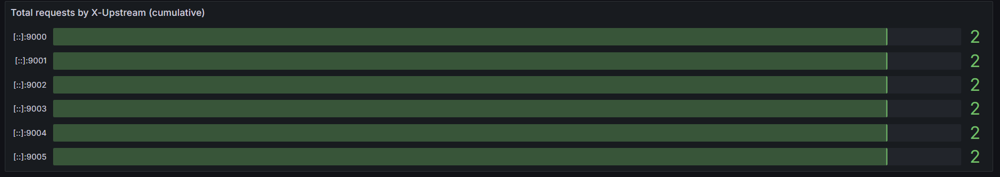
  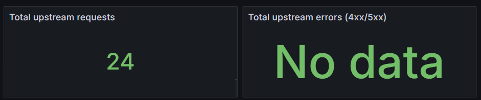
</div>


---

## TLS Termination

- Terminates HTTPS at the proxy; forwards HTTP to upstreams
- Centralizes certificates and policies at the edge
- Offloads crypto from upstream apps; simplifies their config
- Enables HTTP Strict Transport Security(HSTS), modern TLS, and consistent security posture

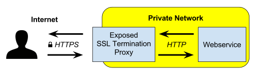

---

### TLS Termination Implementation in FCReverseProxy

- **Server Setup**: `main.go` initializes the proxy and invokes `startServer` with the root handler.
- **TLS Activation**: `startServer` enables HTTPS if `config.tls.enabled` is true.
  - Looks for `tls.certFile` and `tls.keyFile` (defaults: `server.crt`/`server.key`).
  - Missing files trigger auto-generation of a self-signed certificate (RSA 2048, 1-year validity, `localhost` DNS SAN).
  - Self-signed certificates are for **development only**; use real certificates in production.
- **TLS Configuration**:
  - Minimum version: TLS 1.2.
  - Cipher suites follow Go’s secure defaults.
  - HTTP/2 is supported via ALPN.
  - Read/Write timeouts mitigate slowloris attacks.
- **Security Posture**:
  - Centralized termination ensures consistent TLS policies.
  - No mTLS or OCSP stapling yet; planned for future updates.
  - No built-in ACME/Let’s Encrypt support; recommended for production automation.

<style>
ul {
  font-size: 1.0rem;
  line-height: 1.4;
}
</style>


---

### Flow
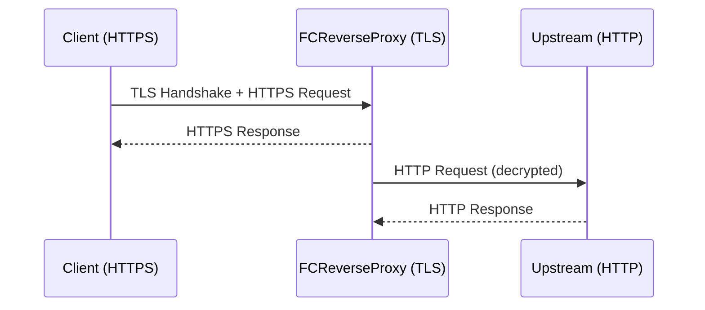

<style>
h1 { color: #2B90B6; }
ul { line-height: 1.4; }
</style>

---

### Code Example : `generateSelfSigned`

<div class="grid grid-cols-2 gap-6 leading-relaxed">

<div>

```go
func generateSelfSigned(certPath, keyPath string) error {
	// Ensure parent directories exist.
	if err := os.MkdirAll(filepath.Dir(certPath), 0o755); err != nil && filepath.Dir(certPath) != "." {
		return err
	}
	if err := os.MkdirAll(filepath.Dir(keyPath), 0o755); err != nil && filepath.Dir(keyPath) != "." {
		return err
	}

	// Generate RSA private key (2048-bit).
	privateKey, err := rsa.GenerateKey(rand.Reader, 2048)
	if err != nil {
		return err
	}

	// Random serial number.
	serialNumberLimit := new(big.Int).Lsh(big.NewInt(1), 128)
	serialNumber, err := rand.Int(rand.Reader, serialNumberLimit)
	if err != nil {
		return err
	}

	// Self-signed cert for localhost (1 year).
	certTemplate := &x509.Certificate{
		SerialNumber: serialNumber,
		Subject: pkix.Name{
			CommonName:   "localhost",
			Organization: []string{"auto-generated"},
		},
		NotBefore:             time.Now().Add(-1 * time.Minute),
		NotAfter:              time.Now().Add(365 * 24 * time.Hour),
		KeyUsage:              x509.KeyUsageDigitalSignature | x509.KeyUsageKeyEncipherment,
		ExtKeyUsage:           []x509.ExtKeyUsage{x509.ExtKeyUsageServerAuth},
		BasicConstraintsValid: true,
		DNSNames:              []string{"localhost"},
	}

	certDER, err := x509.CreateCertificate(rand.Reader, certTemplate, certTemplate, &privateKey.PublicKey, privateKey)
	if err != nil {
		return err
	}

	// Write cert (PEM).
	certOut, err := os.Create(certPath)
	if err != nil {
		return err
	}
	defer certOut.Close()
	if err := pem.Encode(certOut, &pem.Block{Type: "CERTIFICATE", Bytes: certDER}); err != nil {
		return err
	}

	// Write key (PEM, 0600).
	keyOut, err := os.OpenFile(keyPath, os.O_CREATE|os.O_WRONLY|os.O_TRUNC, 0o600)
	if err != nil {
		return err
	}
	defer keyOut.Close()
	if err := pem.Encode(keyOut, &pem.Block{Type: "RSA PRIVATE KEY", Bytes: x509.MarshalPKCS1PrivateKey(privateKey)}); err != nil {
		return err
	}

	log.Printf("Generated self-signed certificate (%s, %s) for localhost", certPath, keyPath)
	return nil
}
```

</div>

<div>

### Observations
- Generates a 2048-bit RSA key and self-signed X.509 cert for localhost.
- Validity: 1 year; slight backdate to avoid clock skew.
- Ensures directories exist; writes PEM files (key with 0600 perms).
- Used when TLS is enabled but cert/key are missing; intended for development.

</div>

</div>

---

### Code Example : `startServer`

<div class="grid grid-cols-2 gap-6 leading-relaxed">

<div>

```go
func startServer(appConfig *config.Config, rootHandler http.Handler) error {
  if !appConfig.TLS.Enabled {
    // Plain HTTP mode
    log.Printf("Starting HTTP on %s", appConfig.ListenAddr)
    return http.ListenAndServe(appConfig.ListenAddr, rootHandler)
  }

  // Ensure there is a certificate pair available (create self-signed if missing).
  if err := ensureSelfSignedIfMissing(appConfig.TLS.CertFile, appConfig.TLS.KeyFile); err != nil {
    log.Printf("TLS enabled but could not create self-signed cert: %v (falling back to HTTP)", err)
    return http.ListenAndServe(appConfig.ListenAddr, rootHandler)
  }

  // If cert/key exist, start HTTPS with a conservative TLS configuration.
  if fileExists(appConfig.TLS.CertFile) && fileExists(appConfig.TLS.KeyFile) {
    server := &http.Server{
      Addr:         appConfig.ListenAddr,
      Handler:      rootHandler,
      ReadTimeout:  15 * time.Second,
      WriteTimeout: 30 * time.Second,
      TLSConfig: &tls.Config{
        MinVersion: tls.VersionTLS12,
      },
    }
    log.Printf("Starting HTTPS (static/self-signed) on %s cert=%s key=%s", appConfig.ListenAddr, appConfig.TLS.CertFile, appConfig.TLS.KeyFile)
    return server.ListenAndServeTLS(appConfig.TLS.CertFile, appConfig.TLS.KeyFile)
  }
}
```

</div>

<div>

### Observations
- **Plain HTTP Mode**: Starts an HTTP server if TLS is disabled.
- **Default Certificate Handling**: Uses `server.crt` and `server.key` as defaults if no certificate paths are provided.
- **Fallback to HTTP**: Falls back to HTTP if certificate generation fails or files are missing.
- **TLS Configuration**:
  - Configures read and write timeouts to enhance security and prevent slowloris attacks.

</div>

</div>


---


### TLS Termination — Test

Validates TLS config parsing and a basic HTTPS handshake path.

<style>
table { font-size: 0.80rem; line-height: 1.15; }
</style>

| Test | Purpose | Validates |
|------|---------|-----------|
| `TestTLSConfig_StaticCert_EnvParsing` | Loads config with TLS enabled and static cert/key | - `cfg.TLS.Enabled == true` <br> - Cert/Key file paths parsed and normalized <br> - Default config path resolution (`./configs/config.yaml`) |
| `TestTLS_StaticHandshake` | Starts HTTPS server with self-signed cert and performs a request | - 200 OK response <br> - TLS connection state present (`resp.TLS != nil`) <br> - Peer certificate available (`len(resp.TLS.PeerCertificates) > 0`) |

Key assertions
- Config loader correctly reads TLS fields (enabled, cert_file, key_file).
- Static TLS handshake succeeds with valid response and populated TLS state.
---
clicks: 3
---

### TLS Termination — Results from Demo Environment

- **Requests**: Simulated using `curl` on a Windows 10 environment.

<!-- Fixed title block -->
<div class="relative h-8 text-xl font-semibold mt-4">
  <div v-click="[1]" class="absolute inset-0">Successful Request with Correct Certificate</div>
  <div v-click="[2]" class="absolute inset-0">Request Without Certificate</div>
  <div v-click="[3]" class="absolute inset-0">Request with Incorrect Certificate</div>
</div>

<!-- Fixed image block -->
<div class="relative w-full h-[400px] mt-4">
  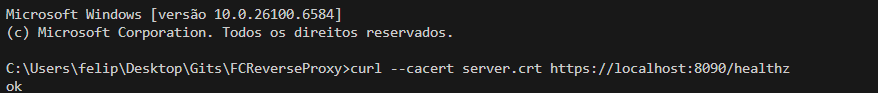
  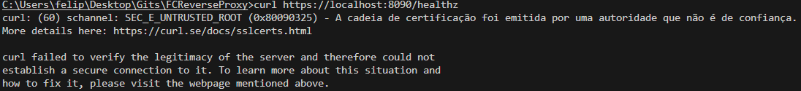
  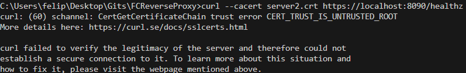
</div>


---

## Request Queue

- Backpressure with a bounded queue and a concurrency limiter  
- Prevents overload, isolates latency spikes, and improves resilience

---

### Request Queue

- Bounded queue controls admission under high load
- Concurrency limiter caps simultaneous upstream requests
- Timeout and client cancel aware while waiting
- Emits optional observability headers
- Exposes Prometheus metrics (depth, timeouts, rejections, wait)

---

### Request Queue Implementation in FCReverseProxy

- Enqueue
  - If queue is full → 429 Too Many Requests
  - Else enter queue and start wait timer
- Acquire slot
  - Competes for a concurrency slot while waiting
- Exit conditions
  - Client canceled → 503 (cancelled while waiting)
  - Timeout → 503 (timed out while waiting)
  - Slot acquired → proceed to upstream
- Headers (optional)
  - X-Concurrency-Limit, X-Queue-Limit, X-Queue-Depth, X-Queue-Wait
- Metrics
  - queue_depth, queue_rejected_total, queue_timeouts_total, queue_wait_seconds

---

### Code Example: `WithQueue`

<div class="grid grid-cols-2 gap-6 leading-relaxed">
<div>

```go
// From internal/proxy/queue.go (simplified)
func WithQueue(next http.Handler, cfg QueueConfig) http.Handler {
  // ...existing code...
  queueWaitCh   := make(chan struct{}, cfg.MaxQueue)      // queued only
  activeSlotsCh := make(chan struct{}, cfg.MaxConcurrent) // active handlers

  return http.HandlerFunc(func(w http.ResponseWriter, r *http.Request) {
    enqueueStart := time.Now()

    // Try enqueue; reject immediately if full.
    select {
    case queueWaitCh <- struct{}{}:
    default:
      // metrics: QueueRejectedInc()
      http.Error(w, "queue full, try again later", http.StatusTooManyRequests)
      return
    }

    // Wait for an active slot vs timeout/client-cancel.
    // ...existing code...
    activeGrantedCh := make(chan struct{}, 1)
    go func() {
      select {
      case activeSlotsCh <- struct{}{}:
        activeGrantedCh <- struct{}{}
      case <-r.Context().Done():
      }
    }()

    timer := time.NewTimer(cfg.EnqueueTimeout)
    defer timer.Stop()

    select {
    case <-r.Context().Done():
      // metrics: QueueWaitObserve(...)
      failQueue(w, r.Context().Err()) // 503
      return
    case <-timer.C:
      // metrics: QueueTimeoutsInc()
      failQueue(w, context.DeadlineExceeded) // 503
      return
    case <-activeGrantedCh:
      // Proceed: leave queue, become active.
    }

    <-queueWaitCh
    defer func() { <-activeSlotsCh }()

    if cfg.QueueWaitHeader {
      w.Header().Set("X-Concurrency-Limit", strconv.Itoa(cfg.MaxConcurrent))
      w.Header().Set("X-Queue-Limit", strconv.Itoa(cfg.MaxQueue))
      // ...existing code to set X-Queue-Depth and X-Queue-Wait...
    }

    next.ServeHTTP(w, r)
  })
}
```

</div>
<div>

Observations
- Immediate 429 when queue capacity is exceeded
- 503 on timeout or client cancel while waiting
- Active slots bounded by MaxConcurrent
- Accurate wait measurement and depth tracking
- Headers are opt-in via QueueConfig.QueueWaitHeader
</div>
</div>

---

### Code Example: Request Queue Integration

- main.go
  - reverseProxy = reverseProxy.WithQueue(appConfig.Queue)
- QueueConfig
  - MaxQueue: max waiting requests
  - MaxConcurrent: max concurrent upstreams
  - EnqueueTimeout: max wait before rejection
  - QueueWaitHeader: enable observability headers

```go
// From cmd/server/main.go (simplified)
queueConfig := appConfig.Queue
reverseProxy = reverseProxy.WithQueue(queueConfig)
```

---

### Request Flow with Queue

<div class="flex flex-col items-center">
  
</div>

<style>
.queue-diagram {
  max-height: 450px;
  max-width: 750px;
}
</style>


---

### Request Queue — Test

<style>
table {
  font-size: 0.70rem;
  line-height: 1.1;
}
</style>

| Test Category                         | Description                                                                                   | Function                                      |
|--------------------------------------|-----------------------------------------------------------------------------------------------|-----------------------------------------------|
| Concurrency limit and queueing       | Respects MaxConcurrent; allows up to MaxQueue queued; overflow returns 429; headers optional | TestQueue_ConcurrencyLimitAndQueueing         |
| Timeout while waiting in queue       | Queued request exceeds EnqueueTimeout and returns 503                                         | TestQueue_TimeoutWhileWaiting                 |
| Client cancellation while queued     | Client cancels context while queued and receives 503                                          | TestQueue_ClientCancellationWhileQueued       |

These tests validate bounded concurrency, proper queuing behavior, and correct error paths (429, 503) under timeout/cancel.

---
clicks: 3
---

### Request Queue — Results from Demo Environment

<div class="relative h-8 text-xl font-semibold mt-4">
  <div v-click="[1]" class="absolute inset-0">Setup and Simulated Load</div>
  <div v-click="[2]" class="absolute inset-0">Configuration</div>
  <div v-click="[3]" class="absolute inset-0">Results</div>
</div>

<div class="relative w-full h-[400px] mt-4">
  <div v-click="[1]" class="absolute inset-0">
    <p>1. <strong>Setup</strong>: Load the configuration and initialize the HTTP client with a timeout slightly longer than the server's <code>enqueueTimeout</code>.</p>
    <p>2. <strong>Simulated Load</strong>: Generate a number of concurrent requests slightly below the total capacity (<code>maxQueue + maxConcurrent - 1</code>) to ensure requests are queued but not rejected.</p>
  </div>
  <div v-click="[2]" class="absolute inset-0">
    <pre><code>queue:
  # Maximum number of requests allowed to wait when max_concurrent is reached.
  max_queue: 50
  # Maximum number of requests processed concurrently (across all targets).
  max_concurrent: 5
  # Maximum time a request may spend waiting in the queue before timing out with 503.
  enqueue_timeout: "5ms"
  # If true, add headers like X-Queue-Wait to admitted requests for observability.
  queue_wait_header: true
</code></pre>
  </div>
  <div v-click="[3]" class="absolute inset-0">
    <div class="w-full flex justify-center mt-6">
      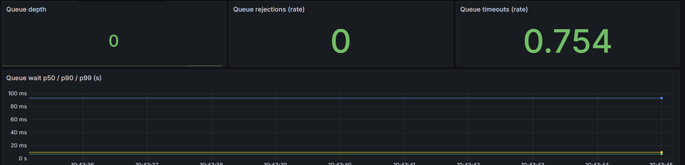
    </div>
  </div>
</div>

---

## Tests Not Previously Highlighted
<style>
table {
  font-size: 0.70rem;
  line-height: 1.1;
}
</style>

| Test Category                                | Description                                                                 | Function(s)                         |
|----------------------------------------------|-----------------------------------------------------------------------------|-------------------------------------|
| Proxy RR with Cache (Integration)            | Round Robin selection correctness with cache in the path.                   | TestProxyRoundRobinWithCache        |
| LC under Mixed Latency (Integration)         | Least Connections prefers faster backends under varied latency.             | TestProxyLeastConnections           |
| HTTPS Self-signed (Integration)              | Proxy serves over HTTPS using generated self-signed certificate.            | TestProxyOverHTTPS                  |
| TLS Cert/Key Mismatch Rejection (Integration)| Startup/handshake fails when cert/key mismatch is detected.                 | TestTLSCertKeyMismatch              |
| High Volume Burst with Queue Limits (Load)   | High-volume burst honors queue + concurrency limits; only 200/429 returned. | TestHighVolume                      |

---

## Metrics, Logging, and Dashboards

This section will be demonstrated live during the presentation. Stay tuned for a working demo showcasing these features in action!

